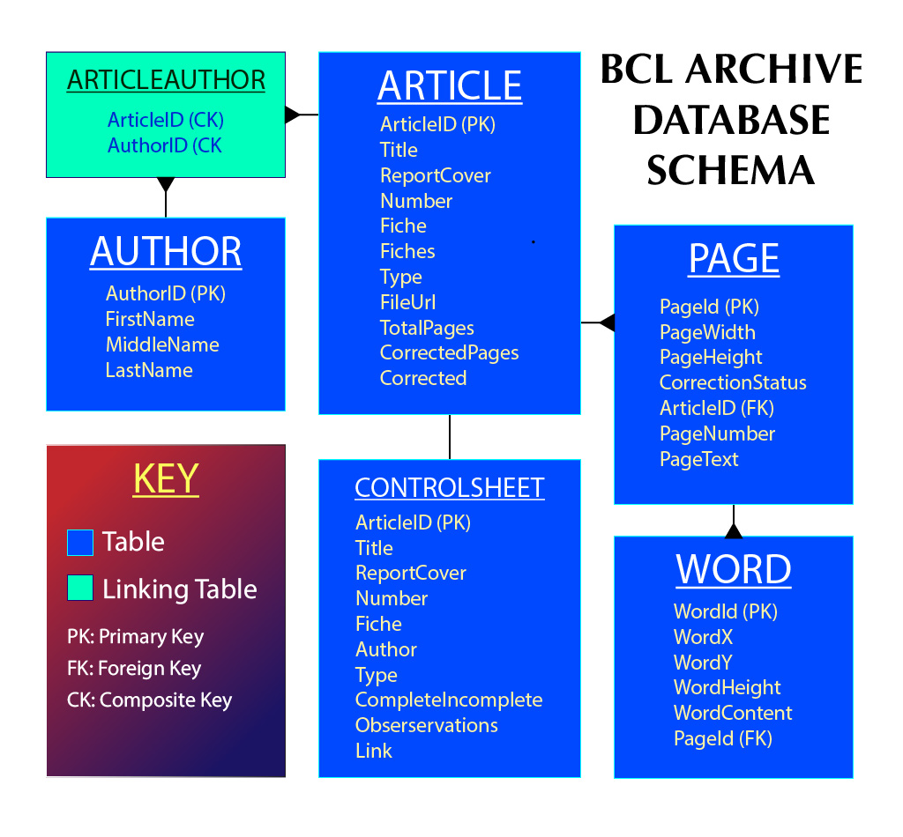

# BCL_Archive
Home to the back-end of bclarchive.net, the digital archive of the Biological Computer Lab, presently browsable at http://bclarchive.net/browse/.

## CONTENTS
* [Introduction](#introduction)
* [Control Sheet](#control-sheet)
* [Database Architecture](#database-architecture)
* [Helper Scripts](#helper-scripts)
* [Hosted Content](#hosted-content)
* [Active Scripts](#active-scripts)
	* [Database Compilation](#database-compilation)
	* [Database Modification](#database-modification)
	* [Simple Searchable Viewer](#simple-searchable-viewer)
* [Continued Development](#continued-development)

### Repository Map

# Introduction
The BCL Archive comprises a trove of cybernetics research published under the scope of the Biological Computer Laboratory at UIUC, starting in 1958 and continuing to 1976. Comprising a melting pot of academic disciplines not limited to theory of logic, systems biology, experimental neurology, electrical engineering and epistemology, the archive provides a scintillating glimpse into the burgeoning atmosphere of the BCL at the inception of the digital age.

The history of this project begins with the doctorate research of Prof. Peter Asaro, which included the work of retrieving from microfische and digitally scanning the complete published catalog the BCL. Asaro then hired student research assistants at the New School to coordinate the production of a digital archive housed to be housed at bclarchive.net.  The first generation of student workers took up the task of converting the data from digital images to PDF documents and recovering the texts using OCR (optical character recognition).  The subsequent phases of production are herein explained in depth.

This documentation mainly details the archive's back-end, being a custom Wordpress theme; the code, however, is largely platform-independent, and comprises mainly Javascript, PHP, SQL, and HTML.  Python and Ruby scripts were used for validation and standardization and, along with various procedural artifacts, may be found in the **proc** directory of the this repository.   All other scripts (ie. those used on the server) may be found in the **live** directory.  Future generations of research assistants and/or interested students should feel free to fork this repository and examine/alter the code for themselves, and kindly note that **all web sources, including stackexchange posts, have been cited**. The following is an overarching explication of production by the lead developer from 2/2018-6/2019, Edmund Eisenberg.

# Control Sheet

The first benchmark of compiling the database was the creation of a master control sheet linking together all relevant details pertaining to the archive's production, including article titles, authors, file locations, fiche locations and more. This work was spearheaded by Sofia, who manually assembled all of the useful metadata in the publications into a single spreadsheet.  Through conversations with the development team, she also implemented stringent standards of formatting author names, file paths, and duplicate/multiple quantities in order to ensure flawless migration to a MySQL database.  These conventions should be maintained in subsequent alterations to the Control Sheet, and are as follows:

- Author names must be formatted "Last, F. (M.)"
- Multiple author names should be separated by "&" exclusively ie. never by commas
- Fiche number must be in 3 digit notation
- Multiple fiches should be indicated by a range, eg. FICHE 004-006
- File paths should follow the pattern, "fiche###_number_reportcover_authors_title.pdf"

# Database Architecture

Foundational to the succesful organization of the archive was the establishment of clear and consistent data structures, encompassing text registration, database schematization and homogenization of the file-name system.  Wrangling a large body of primary-source documents mandated a strong planning convention in the database schema.  This convention was learned in the Lynda.com course "Programming Foundations: Databases with Simon Allardice".  The premise of this schema convention is relational, low-redundancy and purposeful design based on "one-to-many" and "many-to-many" ID relationships.  [An early draft](proc/bcla_early_schema.jpg) of the schema proved essential to achieving the data-sanity and robustness required for implementing a database of the incumbent magnitude, and the current schema is depicted by this image:



The use of a linking table between ARTICLE and AUTHOR tables reflects the "many-to-many" relationship among these two tables, whereas the remaining tables feature "one-to-many" relationships or, in the special* case of the CONTROLSHEET table, a "one-to-one" relationship.

*Usually, "one-to-one" relationships are discouraged in relational databases, by the reasoning that there is no need for more than one table.  However, slight formatting differences between human and machine-readable versions of the same data are license for a "one-to-one" relationship between the ARTICLE and CONTROLSHEET tables.

# Helper Scripts

Although the database was at this point "clear for takeoff", there were several hurdles remaining surrounding the documents:
- The articles were, up till then, organized in directories according to their fiche, but not necessarily in the order of the control sheet.  Furthermore, with the [file name standardization](#control-sheet), fiche directories had become redundant altogether.  It would thus be necessary to substitute this structure for a single, "flat" directory containing all of the articles.
- The file paths used in the original control sheet were URLs to the documents in Google Drive, not the local paths.  Because Google uses hashes in the URLs, there was no direct relationship between these links and the actual file names.  The control sheet would have to be copiously updated to include these file names and there was no clear way of approaching this task.
- Last but not least, there was the formidable problem of OCR inaccuracies found to some degree in nearly all of he PDFs.  This issue should at least be structurally addressed if not fixed altogether.

These issues, for the most part, were tackled programmatically.  Here are the methods used:

#### ficheflatten.rb
To create a flat directory structure, a [ruby script](proc/ficheflatten.rb) was run at the root of the fiche directories. This script not only indexed, consolidated, and cleaned up the documents within, but also corrected various file name inconsistencies such as duplicate  punctuation, invalid whitespace, and improper numerical formatting.

#### filename_matcher.rb
To update the correct URL links in the control sheet, a [pattern-matching ruby script](proc/Estimation/filename_matcher_.rb) was utilized.  This algorithm compared article titles from the Control Sheet to document filenames by evaluating the sequential correspondence between all possible combinations therein using a weighting ledger.  Using this approach, the estimation of correspondence was sufficiently accurate and highly preferable to manual correction.

#### text_scraper.py
The problem of ubiquitous inaccuracies in the OCR remains an issue, but [text-scraping python script](proc/text_scraper.py) was used to exhaustively mine the article texts into XML format.  This contributed significantly towards establishing command over this considerable problem, and there have been attempts at developing a browser-based OCR-correction-interface.  At the time of writing, however, no such interface has been effectively integrated into the archive/database.  This task could be a potential "next step" for future generations of research assistants.	

The output of the processes aforementioned is the cumulative hosted content as summarized in the following section.

# Hosted Content

### PDFs
As [discussed](#ficheflattenrb) in the previous section, the whole of the publications in PDF format were consigned to a single, flat directory with a homogeneous naming convention.  The resulting directory 'fichedir' was then uploaded to the root of bclarchive.net.  Individual PDFs may be accessed by the following URL scheme: http://bclarchive.net/fichedir/filename.pdf

### XML files
The comprehensive text data in XML format (generated by [text_scraper.py](#text_scraperpy)) had to be uploaded to the server so as to be pushed to the database.  These XML files were thus assigned to a directory named 'xml_data'.  The textual information (OCR) extracted by mining the PDFs has been transcribed at a high degree of detail, entailing the pixel height and coordinates of each discrete text object.  The structure of such files is as follows:

```
<pages>
	<page>
		<article> [article_id] </article>
		<page_number> [page_number] </page_number>
		<width> [page_width_px] </width>
		<height> [page_height_px] </height>
		<item>
			<x> [x_coordinate_px] </x>
			<y> [y_coordinate_px] </y>
			<height> [line_height_px] </height>
			<content> [text_content] </content>
		</item>
		<!--
		... items for each text object in page
		-->
	</page>
	<!--
	... additional pages in document
	-->
</pages>			
		
```
It should be noted that, due to rigorous encoding standards of XML, extensive validation of the text was prerequisite and, though not explicitly documented, this is comprehensively referenced by citations included in text_scraper.py.  

# Active Scripts

In this section, a high-level overview will be given of the scripts that are actively deployed on the server.  This includes references to hosted assets as well as the procedural order of deployment.  Public-facing pages are implemented as custom Wordpress [templates](https://developer.wordpress.org/themes/template-files-section/page-template-files/#creating-custom-page-templates-for-global-use), comprising individual files made up of CSS, HTML, PHP, and Javascript within a single document.  These template comprise a custom theme based on "Equable Lite", a free WP theme, and all modifications are contained in the theme's directory, including one "under the hood"* script.

*This script, which is not public-facing, is used for populating the archive database from hosted assets and control sheet content, [db_pusher.php](#db_pusherphp); due its high execution time (~10 minutes), surpassing the usual security-restrictions of a web-server, may only be run as scheduled by using `cron` from the [host's control panel](https://websitesettings.com/login).

## Database Compilation

After the priming described above in ["Database Architecture"](#database-architecture) and ["Helper Scripts"](#helper-scripts) the database was compiled by running a server-side script, db_pusher.php.  The main purpose of this script was to integrate the various primary-source materials into [a comprehensive database] by executing SQL commands through PHP.

### Loading Wordpress
As mentioned above, the script takes over 10 minutes to run from start to finish, and therefore cannot be executed via a webserver ie. by navigating to the host path via URL.  Besides necessitating that it therefore be run via an alternative method, this also means that Wordpress, which is normally loaded during URL access, is not automatically loaded.  Therefore, the first bit of code is borrowing Wordpress's database class, `$wpdb`, so that we may use it to perform our database operations.

```
	# loads Wordpress relative to our theme's directory
require_once(__DIR__.'/../../../wp-load.php'); 
```

Please note that is only necessary because the script is not being accessed through the browser, and that in Wordpress Templates this normally is loaded by default.

### Connecting to the Database

The following lines of code connect to the archive's database using the endogenous Wordpress `$wpdb` class along with the database login parameters.

```
	# login to wpdb	
global $wpdb;
$wpdb = new wpdb('username','password','database','hostname');
```
Since `$wpdb` is a global classname, database operations can (and will!) be performed from anywhere in the code.  The next few lines use this class to connect to the database and query the CONTROLSHEET table, which may be populated with control sheet data as [documented](#database-modification) in the following section.
```
# login to wpdb	
global $wpdb;
$wpdb = new wpdb('username','password','database','hostname');

	# create an array for CONTROLSHEET table data
$control_sheet_rows = [];
	# query CONTROLSHEET table data
$control_sheet_query = "SELECT * FROM CONTROLSHEET";
$control_sheet_results = $wpdb->get_results($wpdb->prepare($control_sheet_query,ARRAY_A));
	# decode query results
foreach($control_sheet_results as $control_sheet_result){
	$control_sheet_rows[] =  json_decode(json_encode($control_sheet_result), true);
}
```
Note that the results returned with `$wpdb->get_results()` must be decoded from JSON into a key-value hash and that a SQL query must be "prepared" before being sent. "Preparing" a query is a Wordpress security measure imposed to prevent a SQL injection attack.

### Pushing the Database
Next, global page and word counter variables will be declared to keep track of these entries separately so that every database table has its own independent numerical ID.
```
$total_pages=0;
$total_words=0;
```
Henceforth, the script loops through every row in the control sheet, parsing and inserting data while linking the corresponding text.  For the ARTICLE, AUTHOR and ARTICLEAUTHOR tables, which are composed solely of control sheet data, the function `insert_row($row)` is employed to perform these database insertions, invoked in each consecutive step of the loop.

The remaining code in the loop fills the PAGE and WORD tables from the XML files, using `$total_pages` and `$total_words` to assign unique IDs to these tables as the loop ensues.

> NOTE: In keeping with the DRY (don't-repeat-yourself) paradigm, there is no column in the ARTICLE table for number-of-pages.  Such information may be formulated by executing a query as follows: `SELECT * FROM PAGES WHERE ArticleId=n` and then counting the number of results...

## Database Modification

> NOTE: While this module is designed to allow user-friendly database updates, it must be used with caution!  Changes made to the database are permanent, and THE **ID** COLUMN SHOULD NEVER BE MODIFIED for any reason.  

The purpose of upload_download.php is to have a page where the control spreadsheet may be downloaded, modified, and then re-uploaded, updating any differences or additions to the database. It consists of three principle mechanisms:
* A user-interface for attaching and downloading control sheet files (.tsv)
* Client-side script (Javascript) for facilitating UI functions, eg. creating files from DOM elements
* Server-side script (PHP) for mediating between the UI and the database

Note that .tsv (tab-separated-values) files are used for the control sheet as opposed to the more common .csv extension.  This is so as to avoid double usage of commas, which are used in formatting the control data.


### User Interface

The UI comprises two functions, the uploading and downloading of the control spreadsheet.  If an administrator wants to make changes to any given metadata, they may, as such, download a current copy of the control sheet, make changes using a program such as Numbers or Excel and re-upload the updated sheet through the page interface.

Under the hood, the interface works by unpacking the uploaded file contents into a hidden input form with id=`hidden_tsv_input`, submitting the quantities through HTTP POST, updating the database through PHP, and then returning the updated quantities into a hidden div with id=`hidden_tsv_output`, from which a file may be synthesized with Javascript; these functions are explained in greater depth within the comments.	

## Simple Searchable Viewer
The ultimate benchmark in the back-end development was the assembly of an basic user-interface by which documents could be searched under numerous filters and viewed.  As more work on the front-end is fully anticipated, this section will attempt to go into as much detail as possible in order to facilitate continuation by a front-end developer at this juncture.

Although developing a single-query search function of the database was simple enough -- accomplished by wrapping SQL statement in PHP search handler functions -- dynamically sorting the results on the client-side would be significantly more challenging.  Since the user should be able to switch between (and reverse) orderings of the results ad arbitrium, it was essential to build-in a static map that could be referenced by Javascript.  The solution was to create a "hidden ledger", that is, an invisible `div` element, where various order mappings -- in the format of comma-separated indices -- could be stored and referenced by Javascript.  The details of this mechanism may be found [below](#results-parser-onload).

In the following subsections, the mechanics of the UI, filtering functions, and suggestions for improvement will be discussed:

### Page UI
The page user-interface is divided into three main parts: a menu, hidden ledger and a view-frame.  The menu, contained within a bar at the top of the window, permits text and navigational input from the user and provides heads-up information, such as the total number of results.  The view-frame displays a list of search result "bubbles", defined by the `.result_bubble` style class, or, alternately, an `iframe` to the PDF document directed by clicking any of these bubbles.  Finally, mappings of alternate result orderings (used by filters) are found in the "hidden ledger" located between the aforementioned window-regions.  The following is a rough outline of the DOM hierarchy:
- Menu
	- Search bar
	- Filter Buttons
	- Session parameters
		- such as number of results and target field, are written into the UI.
- Hidden Ledger
	- found in the div `class="below_bar"`
	- separate div for each ordering
		- eg. result frequency, author name, etc
		- inner HTML contains comma-separated numbers representing result order
- View-frame
	- Result Bubbles
		- UI elements may and search result "bubbles" are rendered to the document.
		- `iframe` to PDF document 

### Results Parser (onLoad)
Once PHP has finished supplying the search results and all HTML has been fully rendered to the page, the function, `parseResults()`, will be triggered by the `body onload` event.   This function will read "session parameters" from the UI as well as the search results from the DOM in order to perform a number of tasks:
* reads session parameters and results from DOM.
* Computes order mappings from the supplied results and appends them to "hidden ledger".
* Evaluates session parameters so as to enable/disable specific actions (see toggle buttons)
	* eg. Relevance is disabled by default, since there is no search term on the first page load.
* Default is rendering all documents in order of the [BCL index](http://bclarchive.net/fichedir/fiche0_WilsonK_DayDJohn_AuthorIndex1957-1976.pdf)
		
### Filter Functions
The user may select various sorting parameters including:
	* Relevance (number of hits per article)
	* Title, alphabetically
	* Author, alphabetically
	* Fiche (default)
	* Reverse (reverses the apparent order of current results)
Whenever a user presses a button, a Javascript function, `applyCritFilter()`, is called that reconstructs the `results` div according to the specified criterion, save for the "reverse order" button, which calls its own function, `reverseSort()`.   These functions, as well as the functional system as a whole, may be more fully understood by consulting the code which is meticulously annotated.

### Continued Development

This final section will briefly suggest possible directions from which development may be picked up.
* first and foremost, visual re-design of the UI
*  adding more search fields/ level-of-detail
	* eg. search by first, middle names ...
	* more detailed information about distribution of search results
		* eg. results-per-page, results-per-author
* embed hyperlinks into search results
	* eg. author names link to author-sort filter

Please direct any questions to Edmund at ned.eisenberg@gmail.com or 608-692-0889.
<!-- 
### Collation and OCR - Yelena w Sofia, Sara
The first step was the collation of a burgeoning repository of scanned TIFF images into organized PDF documents corresponding to all publications and their Fiche locations. 

### Control Sheet Population – Sofia

### flat document organization - Sofia + Ned
####	renaming
####	flattening
####	mapping to control column
####	uploading

### Website Foundations – Ned
####	schematization
####	control sheet upload +download
####	document parsing & validation
####	db compilation

### Front End
####	Search bar => queries db
####	results filter=>sorts results (!fill div arrays)
####		hidden ledgers
####	reverse sort
####	article display


List of procedures

Python
Ruby
upload_download.php
db_pusher.php

Templates

Server-side Scripts

Other Scripts
 -->
